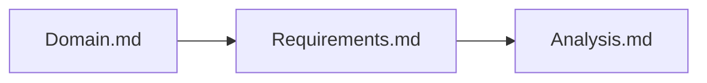
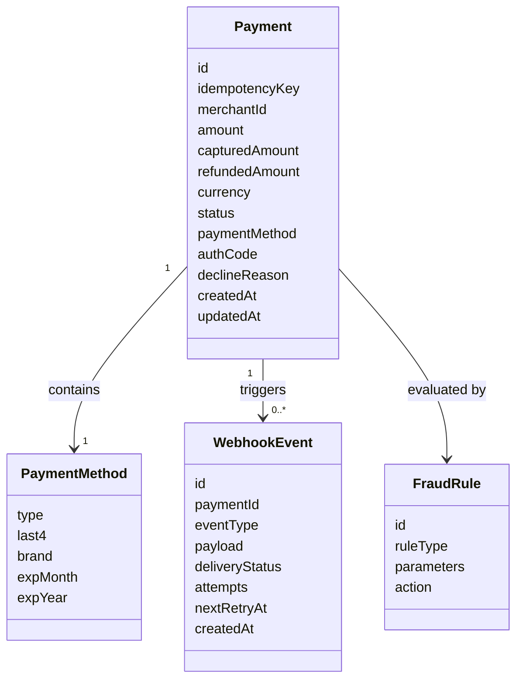
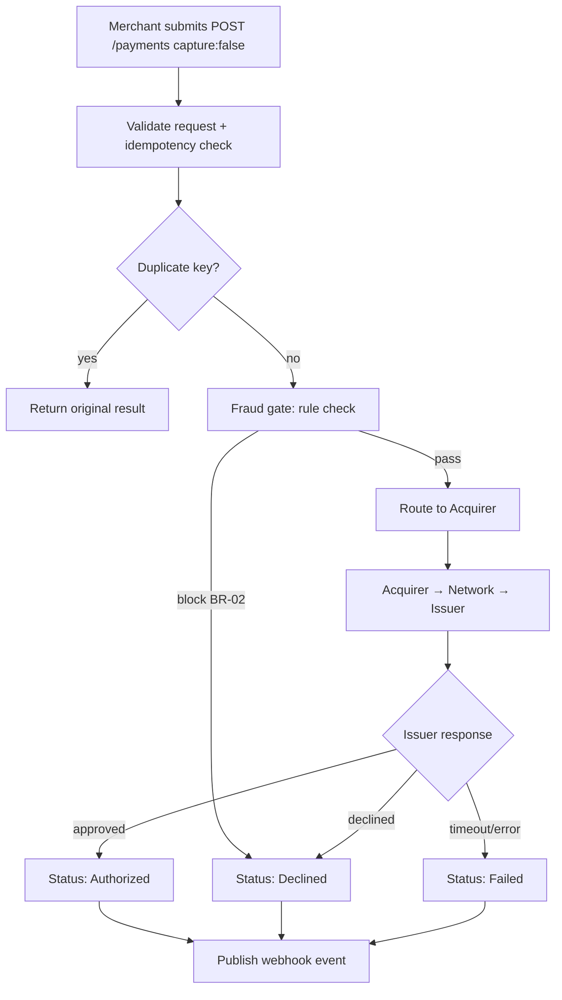
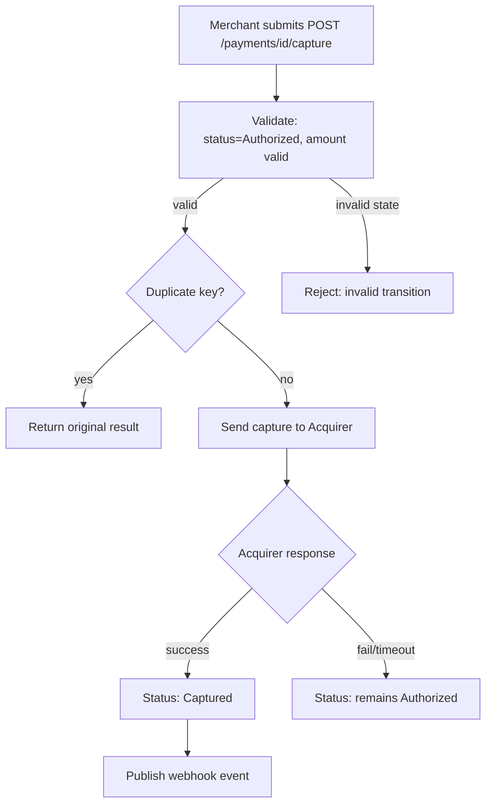
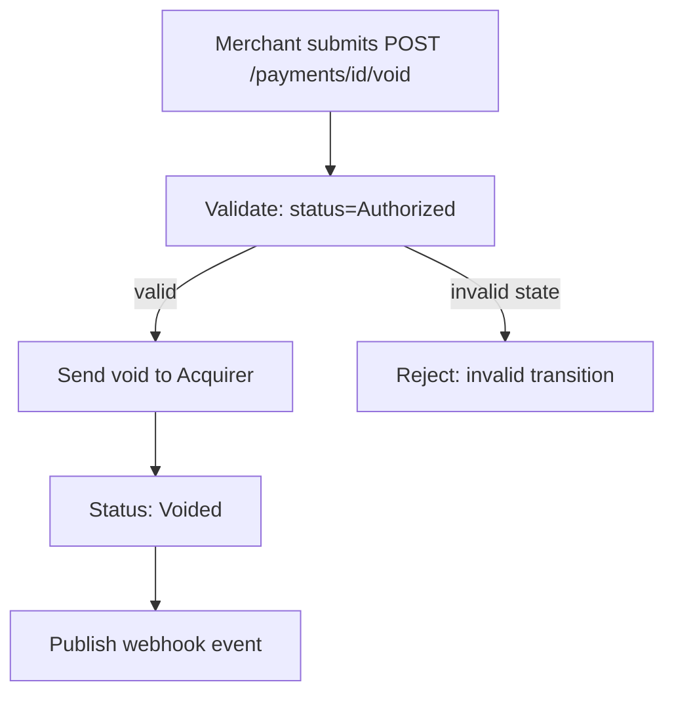
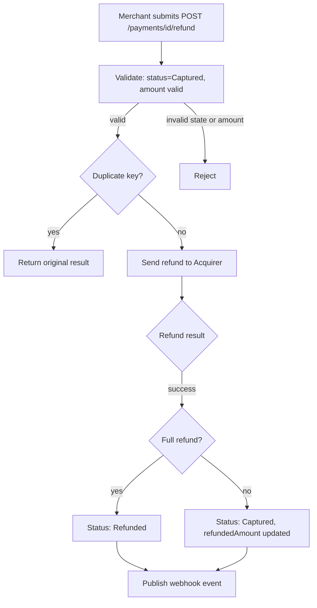
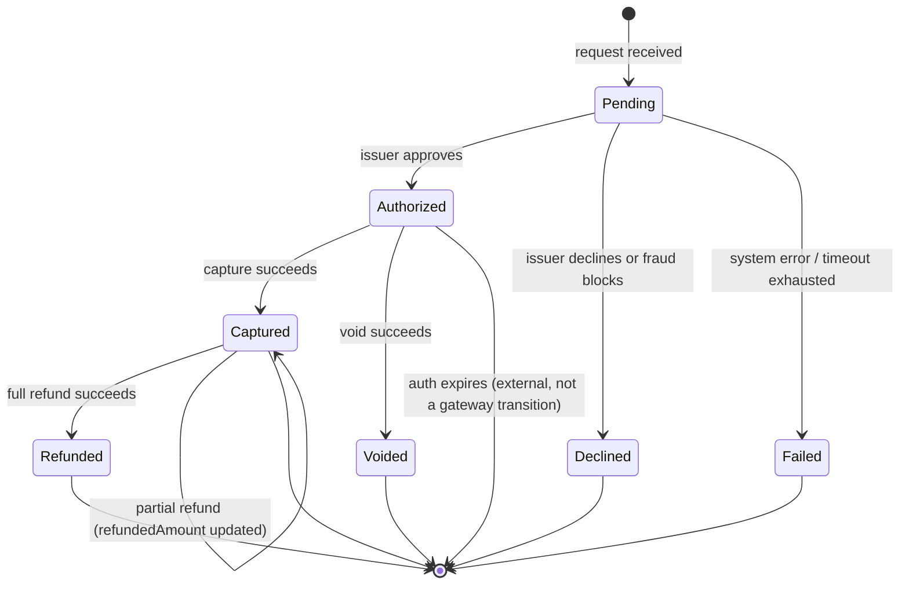

# Analysis

This file analyses [Requirements.md](Requirements.md). Source of truth remains [Domain.md](Domain.md). No PlantUML or C4 here.

---

## 1. Problem framing

One bounded context: **online payment processing**. The merchant initiates a payment operation via API. The system applies a **fraud gate** (rule-based, pass/fail), then routes to the **acquirer** which communicates with the card network and issuing bank.

Two primary flows after authorization:

- **Direct charge** — authorize + capture in one call; funds move immediately.
- **Two-phase** — authorize first (hold funds), capture later (move funds); with void available before capture and refund available after capture.

**Webhook** is a side-effect of status changes, delivered asynchronously and decoupled from the payment processing path.

**Query** is a read model served from the gateway's own store without calling external systems.

Stories in scope: US-01 … US-09. Card issuing, recurring billing, disputes/chargebacks, 3DS, multi-currency, POS, and KYC/AML are out of the problem.

---

## 2. Domain model

Acquirer, Card Network, and Issuing Bank are **external**. This context owns the payment command, fraud gate, status lifecycle, and webhook projection.

| Entity | Responsibility | Notes |
|---|---|---|
| `Payment` | Command/write identity; tracks lifecycle | `status` per US-06. `idempotencyKey` is the business dedup key (US-07). `capturedAmount` and `refundedAmount` track partial operations. |
| `PaymentMethod` | Card or wallet details for a payment | Embedded in Payment. Contains masked card info (last4, brand, expiry). |
| `WebhookEvent` | Async notification record | Tracks delivery attempts, status, next retry. Decoupled from payment write path (NFR-02). |
| `FraudRule` | Gate configuration | Rule-based; evaluated on auth path only (NFR-04). Not on capture/void/refund. |

---

## 3. Business rules

Derived only from Domain.md / Requirements.md.

| ID | Rule | Stories |
|---|---|---|
| BR-01 | Fraud gate runs **after** request validation but **before** acquirer routing. Only on authorization path. | US-01, US-02, NFR-04 |
| BR-02 | Fraud gate block → `Declined` with reason `fraud_rule`; no acquirer call. | US-01, US-02 |
| BR-03 | Issuer decline → `Declined` with issuer reason code; no capture attempted. | US-01, US-02, US-03 |
| BR-04 | Same idempotency key → return original result; no second acquirer call, no second fraud check, no double-charge. | US-07, NFR-01 |
| BR-05 | Different idempotency key → new payment operation; may result in new charge. | US-07 |
| BR-06 | Acquirer timeout with unknown outcome → retry with same reference (status poll or identical message); not a new transaction. | US-01, US-07 |
| BR-07 | Payment status transitions must follow the state machine; invalid transitions rejected at API level. | US-06, NFR-05 |
| BR-08 | Void is valid only on `Authorized` payments. Cannot void `Captured`, `Voided`, `Declined`, or `Failed`. | US-04, US-06 |
| BR-09 | Refund is valid only on `Captured` payments. Refund amount ≤ (captured - already refunded). | US-05, US-06 |
| BR-10 | Partial refund: payment remains `Captured` with `refundedAmount` updated. Full refund: status → `Refunded`. | US-05 |
| BR-11 | Capture is valid only on `Authorized` payments. Capture amount ≤ authorized amount. | US-03, US-06 |
| BR-12 | Direct charge (US-02): authorize + capture in one call. If auth succeeds but capture fails, payment remains `Authorized`. | US-02 |
| BR-13 | Webhook fires asynchronously on every status change. Must not block synchronous API response. | US-08, NFR-02 |
| BR-14 | Webhook delivery is at-least-once with retry. Merchant must handle duplicates. | US-08 |
| BR-15 | Webhook payload includes HMAC signature for merchant verification. | US-08 |
| BR-16 | Payment queries served from gateway's own store; no real-time call to acquirer or card network. | US-09, NFR-03 |
| BR-17 | Invalid card data (Luhn fail, expired) rejected before acquirer. | US-01 |
| BR-18 | Fraud gate does NOT appear on capture, void, or refund paths. | NFR-04, Domain |

---

## 4. Flows

### 4.1 Authorization flow (two-phase)

### 4.2 Capture flow

### 4.3 Void flow

### 4.4 Refund flow

---

## 5. State machine

| Status | Meaning | Valid next transitions |
|---|---|---|
| `Pending` | In flight to acquirer | `Authorized`, `Declined`, `Failed` |
| `Authorized` | Funds held by issuer | `Captured`, `Voided` |
| `Captured` | Funds transferred | `Refunded` (full), `Captured` (partial refund updates amount) |
| `Voided` | Hold released, no capture | Terminal |
| `Refunded` | Full refund processed | Terminal |
| `Declined` | Rejected by issuer or fraud | Terminal |
| `Failed` | System/network error | Terminal |

**Direct charge (US-02):** Merchant sees `Pending` → `Captured` (or `Declined`/`Failed`). Internally, auth + capture happen sequentially, but the intermediate `Authorized` state is transient and not exposed.

---

## 6. Cross-cutting

**Idempotency unit.** One `idempotencyKey` binds together: fraud check, acquirer call, status transition, and webhook event. A retry must return current status, not start a second operation (BR-04). If acquirer timeout occurred and outcome is unknown, retry must poll or resend — not create a new transaction (BR-06).

**Fraud gate position.** Fraud Engine evaluates rules after validation, before acquirer routing. It does NOT re-evaluate on capture, void, or refund (BR-01, BR-18). This means a captured payment can still be refunded even if fraud rules would now block the same card.

**Webhook independence.** Events are published to a queue/topic after status changes. Webhook Service consumes and delivers independently. Delivery failure does not affect payment state. At-least-once semantics means merchants must be idempotent consumers (BR-13, BR-14).

**State integrity.** The status field is the single source of truth for valid operations. Every API mutation first validates current status against allowed transitions. Invalid transitions are rejected before any external call (BR-07).

---

## 7. Story traceability

| Story | Business rules | Entities | Flow / state |
|---|---|---|---|
| US-01 Authorize | BR-01, BR-02, BR-03, BR-04, BR-06, BR-17 | Payment, PaymentMethod, FraudRule | Auth flow → `Authorized` / `Declined` / `Failed` |
| US-02 Direct charge | BR-01, BR-02, BR-03, BR-12 | Payment, PaymentMethod | Auth flow → immediate capture → `Captured` / `Declined` |
| US-03 Capture | BR-07, BR-11 | Payment | Capture flow → `Captured` |
| US-04 Void | BR-07, BR-08, BR-18 | Payment | Void flow → `Voided` |
| US-05 Refund | BR-07, BR-09, BR-10, BR-18 | Payment | Refund flow → `Refunded` or partial |
| US-06 Status lifecycle | BR-07, BR-08, BR-09, BR-11 | Payment.status | State machine above |
| US-07 Idempotency | BR-04, BR-05, BR-06 | Payment.idempotencyKey | Dedup check at entry of every write flow |
| US-08 Webhook | BR-13, BR-14, BR-15 | WebhookEvent | Async publish after status change |
| US-09 Query | BR-16 | Payment (read) | GET from gateway store, no external calls |
| NFR-01 | BR-04 | Payment.idempotencyKey | No duplicate acquirer calls |
| NFR-02 | BR-13 | WebhookEvent | Async, non-blocking |
| NFR-03 | BR-16 | Payment (read store) | No acquirer/network dependency on read |
| NFR-04 | BR-01, BR-18 | FraudRule | Auth path only, not post-auth |
| NFR-05 | BR-07 | Payment.status | Enforced transitions |

---

## 8. Open assumptions

Not specified in Domain.md / Requirements.md. Analysis must not treat these as decided product rules.

| ID | Topic | What is known | What is open |
|---|---|---|---|
| OA-01 | Acquirer timeout / retry | Timeout is a fail path; retry must be idempotent | Duration, max retry count |
| OA-02 | Authorization expiry window | Auth may expire if not captured | Issuer-specific window (typically 7 days) |
| OA-03 | Fraud rule specifics | Rule-based, pass/fail gate | Velocity thresholds, amount ceilings, geo lists |
| OA-04 | Webhook retry schedule | Exponential backoff with max retries | Specific intervals (1m, 5m, 30m?) and max count |
| OA-05 | Settlement timing | Captured payments are settled | Batch frequency, cut-off time |
| OA-06 | Partial capture remainder | Partial capture is allowed | Auto-void remainder vs let expire |
| OA-07 | Supported card networks | Card networks route transactions | Specific networks (Visa, MC, JCB, AMEX) |
| OA-08 | Merchant onboarding | Merchant is authenticated via API key | Provisioning process, key rotation |
| OA-09 | Rate limiting | Merchants call the API | Per-merchant thresholds |
| OA-10 | Currency | Single-currency assumed | Which currency (VND, USD, etc.) |
