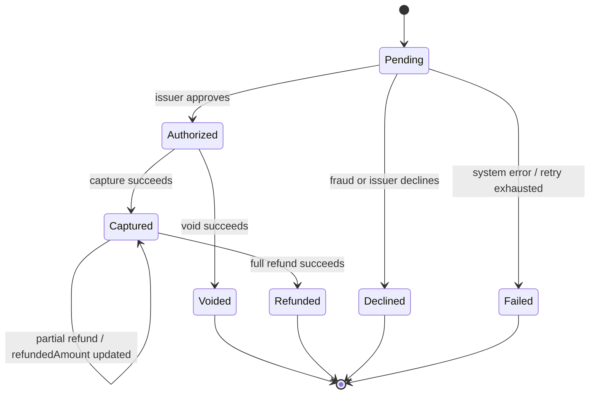

# Design and Test Pack - Online Payment Processing

Title: Payment Lifecycle and Operation Design  
Viewpoint: UML structure and behavior  
Layer(s): Application / Delivery  
As-Is | To-Be | Transition: To-Be prototype design  
Owner: Role Dev / Test  Name Team 3  
RACI: R Dev for sequences, R Test for state/activity  A SA for sequences, A BA for state/activity  C Test, BA, Sec  I Owner, Ops  
Version: v1  Date 2026-08-21  Status Draft  
Legend: `alt` marks an exception branch; solid calls are synchronous; dashed event arrows are asynchronous; participants are actors or Lab 1 container names.  
RACI legend: R = draws; A = approves; C = consulted; I = informed  
Scope: named use cases and the single Payment state machine; no class explosion, implementation, automated execution, or runtime deployment.

## D1 Scope

Requirements are US-01 through US-09 and NFR-01 through NFR-05 in [Requirements.md](Requirements.md). The design uses the identity index in [Modeling-Pack.md](Modeling-Pack.md). Out of scope: Card Issuing, Recurring Billing / Subscriptions, Dispute & Chargeback Management, 3D Secure Authentication, Multi-currency / FX, Physical POS / In-store Payments, and KYC / AML.

## D2 Domain design

The domain identities remain the same as [Analysis.md](Analysis.md):

- `Payment`: `id`, `idempotencyKey`, `merchantId`, `amount`, `capturedAmount`, `refundedAmount`, `status`, `paymentMethod`, `authCode`, `declineReason`, timestamps.
- `PaymentMethod`: type, masked details, brand, expiry metadata.
- `WebhookEvent`: payment ID, event type, payload, HMAC signature, delivery status, attempts, next retry time.
- `FraudRule`: rule identity, rule type, parameters, and pass/block action.

`Payment Store` owns Payment and PaymentMethod. `Webhook Service` owns WebhookEvent delivery records. `Fraud Engine` owns FraudRule evaluation. `Query Store` is a projection and not a competing write master.

## D3-D10 Named UML views

PlantUML sources:

- All operation sequences: `../puml/puml/payment-sequences.puml`
- State and activity: `../puml/puml/payment-state-activity.puml`

### Authorization - US-01

`Merchant -> Payment API -> Payment Orchestrator -> Payment Store` validates and checks the key. A duplicate key returns the stored result. A new key calls `Fraud Engine`; only a pass calls `Acquirer Connector`. Acquirer approval records `Authorized`; fraud or issuer decline records `Declined`; exhausted unknown-outcome handling records `Failed`. Each status change publishes asynchronously.

### Direct charge - US-02

The request uses the authorization path, then calls `Acquirer Connector` for capture immediately after authorization. The transient `Authorized` state is internal and not exposed as the merchant result. Authorization failure has no capture call. Capture failure leaves Payment `Authorized` and notifies the Merchant to retry capture.

### Capture - US-03

`Payment Orchestrator` validates current status `Authorized` and amount <= authorized amount, then calls `Acquirer Connector`. No `Fraud Engine` participant exists on this path. Acquirer failure leaves Payment `Authorized`.

### Void - US-04

`Payment Orchestrator` accepts only `Authorized`, then calls `Acquirer Connector` and records `Voided`. No `Fraud Engine` participant exists. Void after capture or on another state is an explicit invalid-state rejection.

### Refund - US-05

`Payment Orchestrator` accepts only `Captured` and amount <= captured amount - already refunded amount, then calls `Acquirer Connector`. No `Fraud Engine` participant exists. Partial success updates `refundedAmount` and retains `Captured`; full success becomes `Refunded`.

### Webhook - US-08

A status change is written before publication to `Webhook Event Queue`. `Webhook Service` consumes the event asynchronously, adds an HMAC signature, and delivers it to `Merchant`. A non-2xx response retries according to the still-open policy; exhausted delivery becomes `failed_delivery`. The payment response is returned independently.

### Query - US-09

`Merchant -> Payment API -> Query Store` returns payment detail or a page. It never calls `Acquirer`, `Card Network`, or `Issuing Bank`.

## D8 State machine

One object only: `Payment`.

Only these statuses are allowed: `Pending`, `Authorized`, `Captured`, `Voided`, `Refunded`, `Declined`, `Failed`. Invalid transitions are rejected. Authorization expiry is an external acquirer condition and does not add a gateway state.

## Activity / business path

1. Receive operation.
2. Validate request and idempotency key.
3. If duplicate, return original result.
4. If authorization or direct charge, run Fraud Engine.
5. If fraud blocks, record `Declined` and publish event.
6. Otherwise call Acquirer Connector synchronously.
7. Apply the operation-specific state transition.
8. Persist to Payment Store and project Query Store.
9. Publish to Webhook Event Queue without waiting for delivery.
10. Return the synchronous result.

Decision branches carry CON.1 idempotency, CON.2 fraud placement, CON.3 lifecycle, CON.4 async webhook, and CON.5 local query constraints.

## D11 Failure paths

| Failure | Required behavior |
|---|---|
| Fraud block | `Declined` with fraud reason; no Acquirer call. |
| Issuer decline | `Declined` with issuer reason; no capture. |
| Acquirer timeout / unknown outcome | Reuse the same external reference for poll or retry; do not initiate a new transaction. |
| Invalid state transition | Reject at Payment API; do not call Acquirer. |
| Capture amount exceeds authorized | Reject; remain `Authorized`. |
| Refund amount exceeds remaining refundable | Reject; remain `Captured`. |
| Direct-charge capture failure | Remain `Authorized`; Merchant retries capture. |
| Webhook delivery failure | Retry asynchronously; after open maximum policy is exhausted, mark `failed_delivery` and expose it for polling. |

## D12 Business-rule evidence

| BR | Evidence |
|---|---|
| BR-01 | Authorization sequence: validation -> Fraud Engine -> Acquirer Connector. |
| BR-02 | Authorization `alt` fraud block. |
| BR-03 | Authorization `alt` issuer decline; no capture. |
| BR-04 | Idempotency `alt` on authorization, capture, and refund. |
| BR-05 | New-key branch in each write sequence. |
| BR-06 | Acquirer timeout `alt` reuses the same reference. |
| BR-07 | Payment state machine and invalid-state `alt`s. |
| BR-08 | Void sequence precondition `Authorized`. |
| BR-09 | Refund sequence precondition `Captured` and remaining amount. |
| BR-10 | Refund full/partial `alt`. |
| BR-11 | Capture sequence amount guard. |
| BR-12 | Direct-charge sequence and capture-failure `alt`. |
| BR-13 | Status change -> Webhook Event Queue asynchronous publication. |
| BR-14 | Webhook delivery retry and failed-delivery branch. |
| BR-15 | Webhook Service adds HMAC signature. |
| BR-16 | Query sequence reads Query Store only. |
| BR-17 | Payment API validation rejects invalid payment method before Acquirer. |
| BR-18 | Capture, void, and refund sequences contain no Fraud Engine. |

## D13 Open assumptions

OA-01 acquirer timeout/retry duration; OA-02 authorization expiry window; OA-03 fraud thresholds; OA-04 webhook retry schedule and maximum; OA-05 settlement timing; OA-06 partial-capture remainder behavior; OA-07 supported card networks; OA-08 merchant onboarding; OA-09 rate limits; OA-10 currency. None is closed here.

## G6 planned test coverage

Tests are planned, not implemented or executed in this drawing pack.

| Scenario | Transition / alt covered | Planned assertion |
|---|---|---|
| Auth approved | `Pending -> Authorized` | One Fraud Engine call, one Acquirer command, authorized event queued. |
| Fraud blocked | `Pending -> Declined` | No Acquirer call; fraud reason and declined event. |
| Issuer declined | `Pending -> Declined` | Issuer reason retained; no capture. |
| Auth timeout | `Pending -> Failed` | Same external reference is reused; no second transaction. |
| Duplicate auth key | Idempotency alt | Original result returned; no second fraud or Acquirer call. |
| Direct charge approved | Internal authorize + capture | Merchant result is `Captured`; no exposed intermediate authorization. |
| Direct charge capture failure | Authorized retained | Capture attempted once per reference; retryable `Authorized`. |
| Capture valid | `Authorized -> Captured` | Amount guard and Acquirer capture. |
| Capture invalid state/amount | Reject | No Acquirer call; state unchanged. |
| Void valid | `Authorized -> Voided` | Hold release command and voided event. |
| Void invalid | Reject | Captured/terminal payment cannot be voided. |
| Refund partial | `Captured -> Captured` | `refundedAmount` increases; status remains Captured. |
| Refund full | `Captured -> Refunded` | Full amount refunded and refunded event queued. |
| Refund excess | Reject | No Acquirer call; refundable amount unchanged. |
| Duplicate capture/refund key | Idempotency alt | Original operation result returned; no duplicate external call. |
| Webhook success | Async delivery | HMAC present; 2xx marks delivered. |
| Webhook failure | Retry / failed_delivery | Payment response is not blocked; eventual failure is queryable. |
| Query detail/list | Read independence | Query Store serves response; no external system call. |

## Lab 3 status

N/A - drawing pack; no implementation, source code, automated test suite, UAT evidence, Docker, or deployed runtime is submitted.
