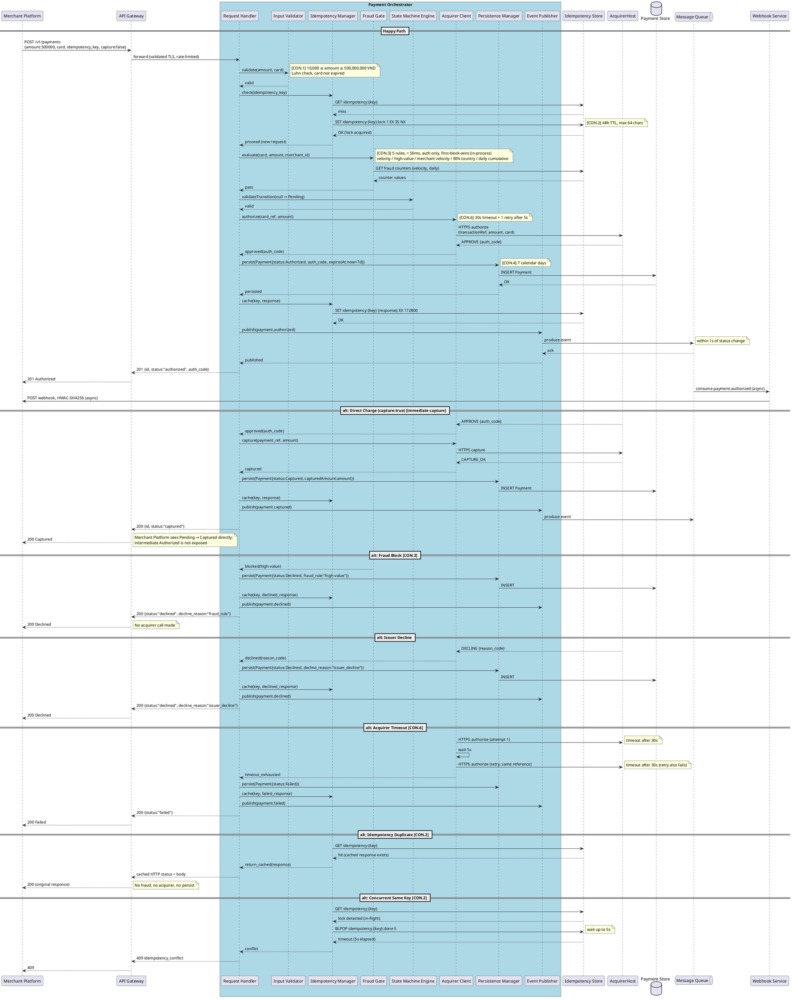
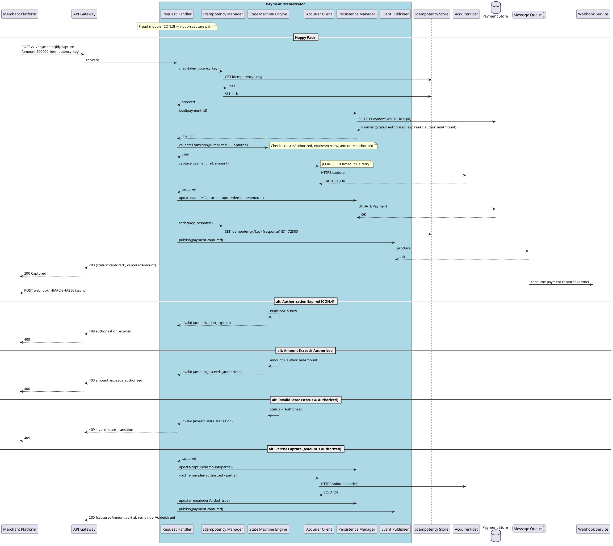
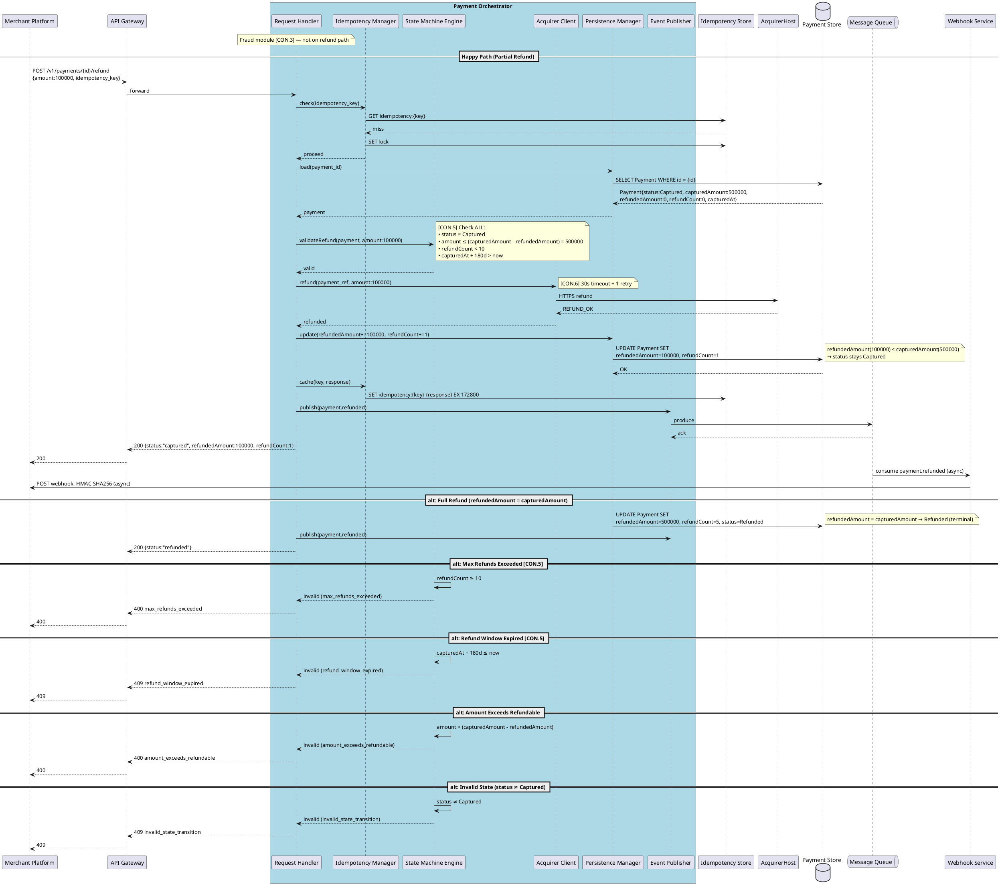

# Lab 10 — UML Low-Level Design for Named C4 Use Cases

**R:** Dev (Kim Đức Minh) · **A:** SA (Nguyễn Quang Huy) · **C:** Test, BA

---

## 1. Sequence — Authorize Payment (with Component internals)

```
Title:      Authorize Payment — Sequence with Component Detail
Viewpoint:  UML Sequence
Layer(s):   Delivery
As-Is | To-Be | Transition:  To-Be
Owner:      Role Dev  Name Kim Đức Minh
RACI:       R Dev  A SA (Nguyễn Quang Huy)  C Test, BA  I Ops
Version:    v1.0  Date 2026-08-20  Status Approved
Legend:      → sync; --→ async; alt = exception; note = CON.*; component modules inside Payment Orchestrator only
RACI legend: R = draws · A = approves · C = consulted · I = informed
Scope:      in-scope: Authorize Payment use case (I-11) / out-of-scope: capture, void, refund
```

### Participants

All participants ⊆ I-4 / I-2 / I-3 (Lab 9 Container names). Component modules shown only inside Payment Orchestrator (the one selected container).



---

## 2. Sequence — Capture Payment (with Component internals)

```
Title:      Capture Payment — Sequence with Component Detail
Viewpoint:  UML Sequence
Layer(s):   Delivery
As-Is | To-Be | Transition:  To-Be
Owner:      Role Dev  Name Kim Đức Minh
RACI:       R Dev  A SA (Nguyễn Quang Huy)  C Test, BA  I Ops
Version:    v1.0  Date 2026-08-20  Status Approved
Legend:      → sync; alt = exception; component modules inside Payment Orchestrator only
RACI legend: R = draws · A = approves · C = consulted · I = informed
Scope:      in-scope: Capture Payment use case (I-11) / out-of-scope: authorize, void, refund
```

### Participants



---

## 3. Sequence — Refund Payment (with Component internals)

```
Title:      Refund Payment — Sequence with Component Detail
Viewpoint:  UML Sequence
Layer(s):   Delivery
As-Is | To-Be | Transition:  To-Be
Owner:      Role Dev  Name Kim Đức Minh
RACI:       R Dev  A SA (Nguyễn Quang Huy)  C Test, BA  I Ops
Version:    v1.0  Date 2026-08-20  Status Approved
Legend:      → sync; alt = exception; component modules inside Payment Orchestrator only
RACI legend: R = draws · A = approves · C = consulted · I = informed
Scope:      in-scope: Refund Payment use case (I-11) / out-of-scope: authorize, capture, void
```

### Participants



---

## 4. UML State — Payment (reference from Lab 5)

The state machine is defined in Lab 5. Per the Guide: "one object per machine; states = I-6."

**Object:** Payment  
**States:** Pending, Authorized, Captured, Voided, Refunded, Declined, Failed  
**Terminal:** Voided, Refunded, Declined, Failed

See [Lab5-UML-LowLevel.md](Lab5-UML-LowLevel.md) §5 for full diagram.

---

## 5. Participant = SUT Map

| Sequence Lifeline | I-4 / I-2 / I-3 Match | Container or Actor |
|-------------------|------------------------|--------------------|
| Merchant Platform | I-3 | External System |
| API Gateway | I-4 | Container |
| Payment Orchestrator (box) | I-4 | Container (drilled to components; fraud module lives in Fraud Gate) |
| Idempotency Store | I-4 | Container |
| AcquirerHost | I-3 | External System |
| Payment Store | I-4 | Container |
| Message Queue | I-4 | Container |
| Webhook Service | I-4 | Container (async, happy path of all three use cases) |

**Component modules (inside Payment Orchestrator only):**
- Request Handler, Input Validator, Idempotency Manager, Fraud Gate, State Machine Engine, Acquirer Client, Persistence Manager, Event Publisher

These are internal to the **one selected container** (Payment Orchestrator) per Lab 9 C4 Component.

---

## 6. Coverage Note (G6)

### All state transitions mapped

| # | Transition | Covered in sequence |
|---|-----------|---------------------|
| 1 | Pending → Authorized | Authorize §1 (happy path) |
| 2 | Pending → Captured (Direct Charge) | Authorize §1 (alt: Direct Charge) |
| 3 | Pending → Declined (fraud) | Authorize §1 (alt: Fraud Block) |
| 4 | Pending → Declined (issuer) | Authorize §1 (alt: Issuer Decline) |
| 5 | Pending → Failed | Authorize §1 (alt: Acquirer Timeout) |
| 6 | Authorized → Captured | Capture §2 (happy path) |
| 7 | Authorized → Voided | (Void flow — same pattern as Capture without fraud) |
| 8 | Authorized → Failed (expired) | (Expiry Job — Lab 5 §5 note) |
| 9 | Captured → Refunded | Refund §3 (alt: Full Refund) |
| 10 | Captured → Captured (partial) | Refund §3 (happy path) |

### All sequence alt fragments mapped

| # | Alt | Use Case | Sequence section |
|---|-----|----------|-----------------|
| 1 | Direct Charge → Captured (immediate capture) | Authorize | §1 alt: Direct Charge |
| 2 | Fraud block → Declined | Authorize | §1 alt: Fraud Block |
| 3 | Issuer decline → Declined | Authorize | §1 alt: Issuer Decline |
| 4 | Idempotency duplicate → cached | Authorize | §1 alt: Idempotency Duplicate |
| 5 | Concurrent same-key → 409 | Authorize | §1 alt: Concurrent Same Key |
| 6 | Acquirer timeout → Failed | Authorize | §1 alt: Acquirer Timeout |
| 7 | Auth expired → 409 | Capture | §2 alt: Authorization Expired |
| 8 | Amount exceeds authorized → 400 | Capture | §2 alt: Amount Exceeds |
| 9 | Invalid state → 409 | Capture | §2 alt: Invalid State |
| 10 | Partial capture → void remainder | Capture | §2 alt: Partial Capture |
| 11 | Max refunds → 400 | Refund | §3 alt: Max Refunds Exceeded |
| 12 | Refund window → 409 | Refund | §3 alt: Refund Window Expired |
| 13 | Amount exceeds refundable → 400 | Refund | §3 alt: Amount Exceeds |
| 14 | Invalid state → 409 | Refund | §3 alt: Invalid State |
| 15 | Full refund → Refunded | Refund | §3 alt: Full Refund |

### Participants = C4 Container names ✓

All lifelines verified against Lab 1 I-4 / I-2 / I-3. Component modules only inside the one selected container (Payment Orchestrator).

**G6 passed:** All transitions + all alts mapped; participants = C4 names. ✓

---

## 7. Comparison Note — Lab 5 vs This Sitting

Lab 10 restyles Lab 5's three use-case sequences against the Guide, using Lab 9's Container/Component names. `Lb/Lab5-UML-LowLevel.md` is left as written — nothing there was edited to look like this file.

### 7.1 Names

| Aspect | Lab 5 (current style) | Lab 10 (this sitting) |
|--------|------------------------|-------------------------|
| Container-level participants | `Merchant Platform`, `API Gateway`, `Payment Orchestrator`, `Idempotency Store`, `AcquirerHost`, `Payment Store`, `Message Queue`, `Webhook Service` — same I-2/I-3/I-4 strings as Lab 1 | Identical strings, no forks |
| Fraud handling | A self-call on `Payment Orchestrator` (no separate lifeline) | Exploded one level further into a named component, `Fraud Gate`, per Lab 9 §3 — still not a container |
| `Payment Orchestrator` detail | One box, opaque | Drilled into 8 components (Request Handler, Input Validator, Idempotency Manager, Fraud Gate, State Machine Engine, Acquirer Client, Persistence Manager, Event Publisher) — the same 8 named in Lab 9 C4 Component |
| Merchant Platform PlantUML type | `actor` (a UML actor stereotype used loosely) | `participant` — `Merchant Platform` is an I-3 external system, not an I-2 person, so it does not get the actor stick-figure |

### 7.2 Language / header

Lab 5 has no diagram header — plain title, a one-line scope note, `plantuml` fences. That is correct for its sitting (current style, pre-Lab 7).

Lab 10 adds, per canvas: `Title / Viewpoint / Layer(s) / As-Is|To-Be|Transition / Owner / RACI / Version / Legend / Scope`, matching the Guide template from Lab 7 §7. This is the only structural difference between the two files — the message-level logic is the same story, told once in plain UML and once through the Guide's packaging.

### 7.3 What this sitting corrected relative to Lab 5

- **Webhook hop.** Lab 5's Authorize sequence already ends `Message Queue → Webhook Service → Merchant Platform` (async). Lab 10 initially stopped at `publish event` on all three use cases; this sitting added the same async hop to Capture and Refund too, so every happy path now ends the way I-11 describes it.
- **Direct Charge alt.** Lab 5's state machine allows `Pending → Captured`, but neither Lab 5 nor the first cut of Lab 10 drew the sequence for it. Added as an `alt: Direct Charge` branch on Authorize.
- **Issuer Decline alt.** Lab 5 draws this as an `else` branch inside the acquirer-call `alt`. The first cut of Lab 10 only referenced it as "implied in Lab 5" in the coverage table without drawing it. Added as its own `alt: Issuer Decline` block.
- **Module boxes inside Payment Orchestrator.** Lab 5 treats `Payment Orchestrator` as one opaque participant. Lab 10 is where the component detail is introduced (per Lab 9 C4 Component) — this is new content in Lab 10, not a fix to Lab 5.
