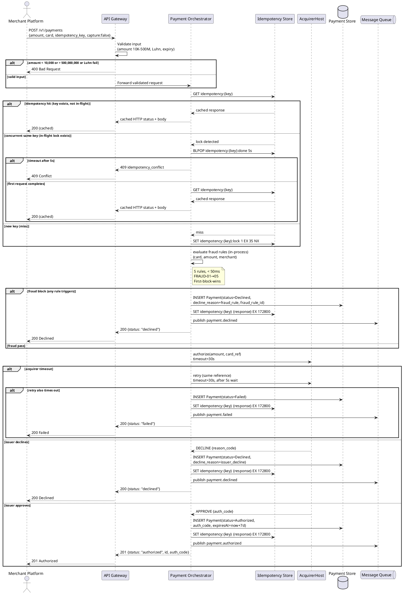
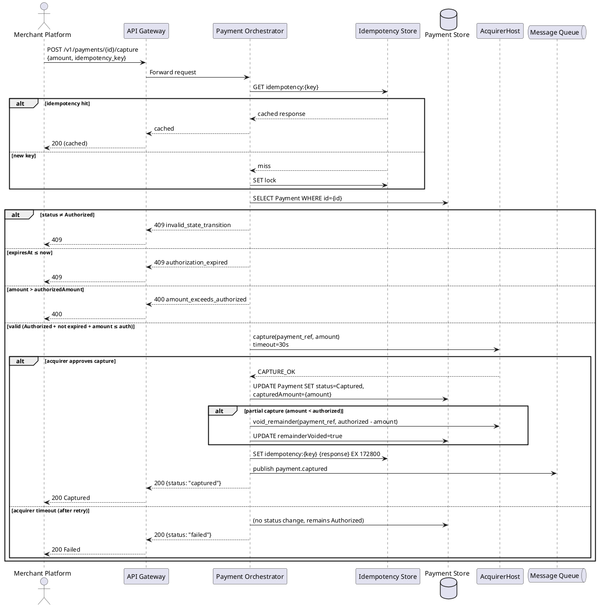
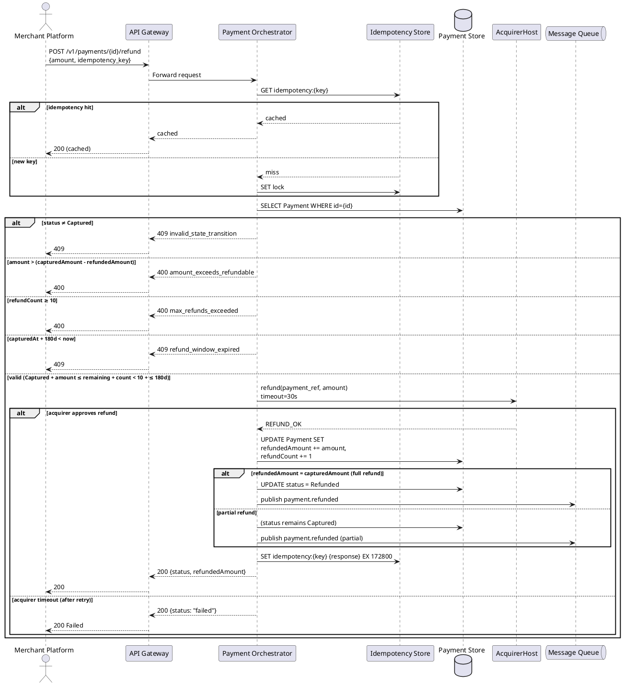
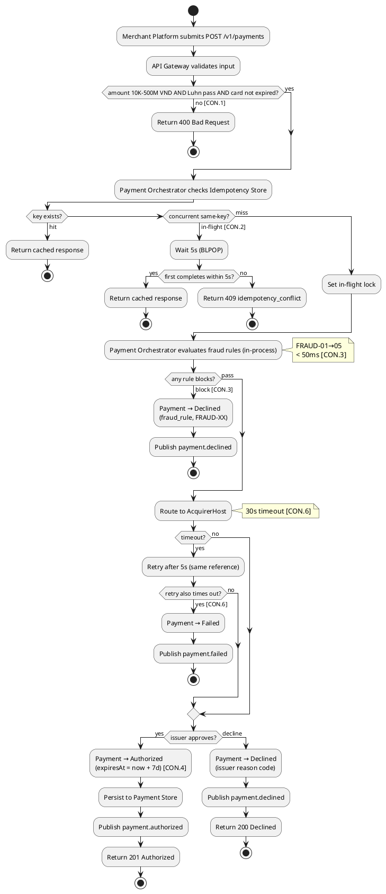
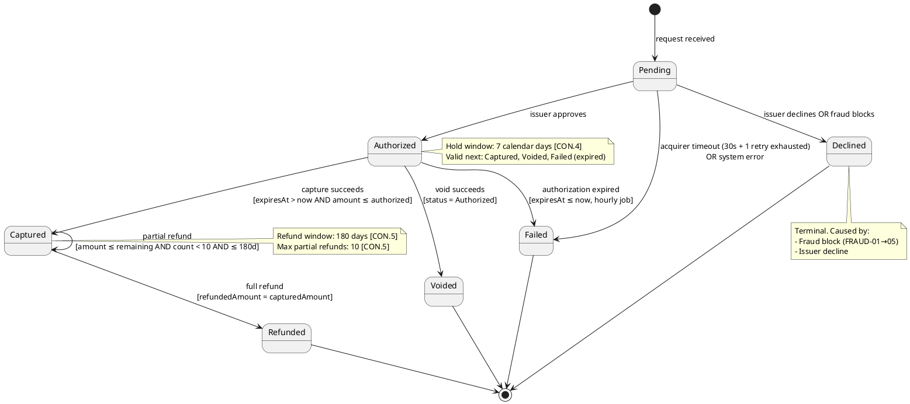

# Lab 5 — Low-Level Design (UML)

**R:** Dev (sequence) · Test (activity/state) · **A:** SA (sequence) · BA (activity/state)

---

## 1. UML Sequence — Authorize Payment

```
Title:      Authorize Payment — Happy Path + Exception
Viewpoint:  UML Sequence
Layer(s):   Delivery
As-Is | To-Be | Transition:  To-Be
Owner:      Role Dev  Name Kim Đức Minh
RACI:       R Dev  A SA  C Test, BA  I Ops
Version:    v1.0  Date 2026-08-20  Status Draft
Legend:      →  sync call; --→  async; alt = exception branch
RACI legend: R = draws · A = approves · C = consulted · I = informed
Scope:      in-scope: US Authorize Payment / out-of-scope: capture, void, refund
```

### Participants (⊆ I-4 containers + I-3 externals)

- Merchant Platform
- API Gateway
- Payment Orchestrator (fraud module evaluates in-process — not a separate participant)
- Idempotency Store
- AcquirerHost
- Payment Store
- Message Queue

### Sequence



---

## 2. UML Sequence — Capture Payment

```
Title:      Capture Payment — Happy Path + Exception
Viewpoint:  UML Sequence
Layer(s):   Delivery
As-Is | To-Be | Transition:  To-Be
Owner:      Role Dev  Name Kim Đức Minh
RACI:       R Dev  A SA  C Test, BA  I Ops
Version:    v1.0  Date 2026-08-20  Status Draft
Legend:      →  sync call; alt = exception branch
RACI legend: R = draws · A = approves · C = consulted · I = informed
Scope:      in-scope: US Capture Payment / out-of-scope: authorize, void, refund
```

### Participants

- Merchant Platform
- API Gateway
- Payment Orchestrator
- Idempotency Store
- Payment Store
- AcquirerHost
- Message Queue

### Sequence



---

## 3. UML Sequence — Refund Payment

```
Title:      Refund Payment — Happy Path + Exception
Viewpoint:  UML Sequence
Layer(s):   Delivery
As-Is | To-Be | Transition:  To-Be
Owner:      Role Dev  Name Kim Đức Minh
RACI:       R Dev  A SA  C Test, BA  I Ops
Version:    v1.0  Date 2026-08-20  Status Draft
Legend:      →  sync call; alt = exception branch
RACI legend: R = draws · A = approves · C = consulted · I = informed
Scope:      in-scope: US Refund Payment / out-of-scope: authorize, capture, void
```

### Participants

- Merchant Platform
- API Gateway
- Payment Orchestrator
- Idempotency Store
- Payment Store
- AcquirerHost
- Message Queue

### Sequence



---

## 4. UML Activity — Payment Authorization Process

```
Title:      Payment Authorization Activity
Viewpoint:  UML Activity
Layer(s):   Delivery
As-Is | To-Be | Transition:  To-Be
Owner:      Role Test  Name Trần Quốc Đạt
RACI:       R Test  A BA  C Dev, SA  I Ops
Version:    v1.0  Date 2026-08-20  Status Draft
Legend:      ◆ = decision; [guard] = CON.* constraint
RACI legend: R = draws · A = approves · C = consulted · I = informed
Scope:      in-scope: authorization happy path + decisions
```



---

## 5. UML State Machine — Payment Object

```
Title:      Payment State Machine
Viewpoint:  UML State Machine
Layer(s):   Delivery
As-Is | To-Be | Transition:  To-Be
Owner:      Role Test  Name Trần Quốc Đạt
RACI:       R Test  A BA  C Dev, SA  I Ops
Version:    v1.0  Date 2026-08-20  Status Draft
Legend:      → transition; [guard]; terminal = double-circle
RACI legend: R = draws · A = approves · C = consulted · I = informed
Scope:      in-scope: Payment object lifecycle / out-of-scope: Webhook Event, Idempotency Entry
```

**Object:** Payment (one object per state machine)



---

## 6. G6 Checklist — Test Coverage

### 6.1 State Transitions → Planned Tests

| # | From | To | Trigger | Planned Test |
|---|------|----|---------|--------------| 
| T1 | Pending | Authorized | Issuer approves | Verify status=Authorized, auth_code set, expiresAt=+7d |
| T2 | Pending | Declined | Fraud blocks | Verify Declined, fraud_rule_id set, no acquirer call |
| T3 | Pending | Declined | Issuer declines | Verify Declined, reason_code from issuer |
| T4 | Pending | Failed | Acquirer timeout exhausted | Verify Failed after 30s+retry |
| T5 | Authorized | Captured | Capture succeeds | Verify Captured, capturedAmount set |
| T6 | Authorized | Voided | Void succeeds | Verify Voided, terminal |
| T7 | Authorized | Failed | Expiry job (7d elapsed) | Verify Failed, decline_reason=authorization_expired |
| T8 | Captured | Refunded | Full refund | Verify Refunded when refundedAmount=capturedAmount |
| T9 | Captured | Captured | Partial refund | Verify stays Captured, refundedAmount += amount |
| T10 | Any invalid | — (rejected) | Invalid transition attempt | Verify 409 invalid_state_transition |

### 6.2 Sequence Alt Fragments → Planned Tests

| # | Use Case | Alt Fragment | Planned Test |
|---|----------|--------------|--------------|
| A1 | Authorize | Fraud block (FRAUD-01→05) | Verify Declined, no acquirer call, fraud_rule_id |
| A2 | Authorize | Idempotency hit | Verify cached response returned, no external calls |
| A3 | Authorize | Idempotency concurrent (5s timeout) | Verify 409 idempotency_conflict |
| A4 | Authorize | Acquirer timeout + retry timeout | Verify Failed after retry exhausted |
| A5 | Authorize | Issuer decline | Verify Declined with reason code |
| A6 | Authorize | Input validation fail (amount/Luhn) | Verify 400, no state created |
| A7 | Capture | Auth expired | Verify 409 authorization_expired |
| A8 | Capture | Amount exceeds authorized | Verify 400 amount_exceeds_authorized |
| A9 | Capture | Status ≠ Authorized | Verify 409 invalid_state_transition |
| A10 | Capture | Partial capture (remainder voided) | Verify capturedAmount < authorized, remainder voided |
| A11 | Refund | Max refunds exceeded (≥10) | Verify 400 max_refunds_exceeded |
| A12 | Refund | Refund window expired (>180d) | Verify 409 refund_window_expired |
| A13 | Refund | Amount exceeds refundable | Verify 400 amount_exceeds_refundable |
| A14 | Refund | Status ≠ Captured | Verify 409 invalid_state_transition |

### 6.3 Participant = C4 Container Name Verification

| Sequence Lifeline | Matches I-4 / I-2 / I-3? | String |
|-------------------|---------------------------|--------|
| Merchant Platform | I-3 External | ✓ Merchant Platform |
| API Gateway | I-4 Container | ✓ API Gateway |
| Payment Orchestrator | I-4 Container | ✓ Payment Orchestrator |
| Idempotency Store | I-4 Container | ✓ Idempotency Store |
| AcquirerHost | I-3 External | ✓ AcquirerHost |
| Payment Store | I-4 Container | ✓ Payment Store |
| Message Queue | I-4 Container | ✓ Message Queue |

**All participants ⊆ Lab 1 name-identity index.** ✓
