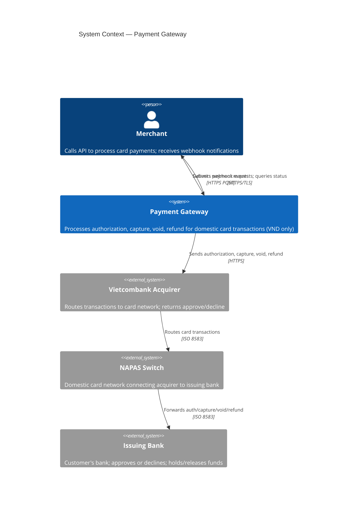
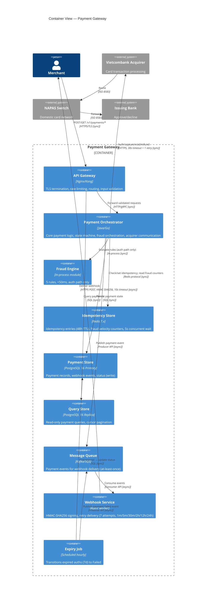

# Lab 9 — C4 Context and Container

**R:** SA · **A:** Owner (Context) · SA (Container) · Dev **R** / SA **A** (optional Component)

---

## 1. C4 Context (Level 1)

```
Title:      Payment Gateway — C4 System Context
Viewpoint:  C4 Context (L1)
Layer(s):   Application
As-Is | To-Be | Transition:  To-Be
Owner:      Role SA  Name Member 2
RACI:       R SA  A Owner  C BA, Sec  I Dev, Test, Ops
Version:    v1.0  Date 2026-08-20  Status Draft
Legend:      [Person] = stick figure; [System] = box; [External] = dashed box; → relationship (what happens)
RACI legend: R = draws · A = approves · C = consulted · I = informed
Scope:      in-scope: system-in-focus + actors + externals / out-of-scope: containers, databases, pods, event buses
```

### Diagram



### Context Elements

| Element | Type | Name (= Lab 1 index) |
|---------|------|----------------------|
| Person | Actor | Merchant |
| System-in-focus | Internal | Payment Gateway |
| External System | External | Vietcombank Acquirer |
| External System | External | NAPAS Switch |
| External System | External | Issuing Bank |

### Relationships (what happens, not protocol)

| From | To | Description |
|------|----|-------------|
| Merchant | Payment Gateway | Submits payment requests (auth, capture, void, refund); queries payment status |
| Payment Gateway | Merchant | Delivers webhook events on status change |
| Payment Gateway | Vietcombank Acquirer | Sends authorization, capture, void, refund requests |
| Vietcombank Acquirer | NAPAS Switch | Routes card transactions |
| NAPAS Switch | Issuing Bank | Forwards authorization/capture/void/refund |

### NOT on Context (forbidden)

- ✗ Containers (API Gateway, Orchestrator, Redis, PostgreSQL, Kafka)
- ✗ Databases
- ✗ Pods / deployment nodes
- ✗ Event buses / message queues
- ✗ Class names / protocol details (30s timeout, HMAC, etc.)
- ✗ Unnamed externals

**G3 Evidence (Context):** No unnamed externals; names = Lab 1 (I-1, I-2, I-3). ✓

---

## 2. C4 Container (Level 2)

```
Title:      Payment Gateway — C4 Container
Viewpoint:  C4 Container (L2)
Layer(s):   Application
As-Is | To-Be | Transition:  To-Be
Owner:      Role SA  Name Member 2
RACI:       R SA  A SA  C DA, Sec, Dev, Ops  I Test
Version:    v1.0  Date 2026-08-20  Status Draft
Legend:      [Container] = box; [External] = dashed; ─── sync; ═══ async; protocol labeled
RACI legend: R = draws · A = approves · C = consulted · I = informed
Scope:      in-scope: I-4 containers + externals; sync/async labeled / out-of-scope: container internals
```

### Diagram



### Container Elements (= I-4 exactly)

| Container Name | Technology | Sync/Async role |
|----------------|------------|-----------------|
| API Gateway | Nginx / Kong | Sync entry point |
| Payment Orchestrator | Java / Go | Sync orchestrator |
| Fraud Engine | In-process module | Sync (auth only) |
| Idempotency Store | Redis 7.x | Sync data store |
| Payment Store | PostgreSQL 16 Primary | Sync write |
| Query Store | PostgreSQL 16 Replica | Sync read |
| Message Queue | Kafka / SQS | Async bridge |
| Webhook Service | Async worker | Async delivery |
| Expiry Job | Scheduled (hourly) | Sync batch |

### Relationship Labels (all have sync/async)

| # | From | To | Protocol | Sync/Async |
|---|------|----|----------|------------|
| 1 | Merchant | API Gateway | HTTPS/TLS | Sync |
| 2 | API Gateway | Payment Orchestrator | HTTP/gRPC | Sync |
| 3 | API Gateway | Query Store | SQL | Sync |
| 4 | Payment Orchestrator | Idempotency Store | Redis GET/SET/BLPOP | Sync |
| 5 | Payment Orchestrator | Fraud Engine | In-process call | Sync |
| 6 | Payment Orchestrator | Vietcombank Acquirer | HTTPS (30s + 1 retry) | Sync |
| 7 | Payment Orchestrator | Payment Store | SQL | Sync |
| 8 | Payment Orchestrator | Message Queue | Publish event | Async |
| 9 | Message Queue | Webhook Service | Consume event | Async |
| 10 | Webhook Service | Merchant | HTTPS POST (HMAC, 10s) | Async |
| 11 | Expiry Job | Payment Store | SQL batch | Sync |
| 12 | Expiry Job | Message Queue | Publish event | Async |
| 13 | Vietcombank Acquirer | NAPAS Switch | ISO 8583 | Sync |
| 14 | NAPAS Switch | Issuing Bank | ISO 8583 | Sync |

### NOT on Container (forbidden)

- ✗ Exploding every container (no component details)
- ✗ Unnamed externals
- ✗ Mixed L1 + L2 + L3 on one canvas

**G3 Evidence (Container):** All relationships labeled sync/async; all names = Lab 1 index (I-2, I-3, I-4); no unnamed externals. ✓

---

## 3. C4 Component (Level 3) — Payment Orchestrator (Optional)

```
Title:      Payment Orchestrator — C4 Component
Viewpoint:  C4 Component (L3)
Layer(s):   Application (one container drill-down)
As-Is | To-Be | Transition:  To-Be
Owner:      Role Dev  Name Member 3
RACI:       R Dev  A SA  C DA, Sec  I Test, Ops
Version:    v1.0  Date 2026-08-20  Status Draft
Legend:      [Component] = box inside container; [Neighbour] = grey box (black-box); → dependency
RACI legend: R = draws · A = approves · C = consulted · I = informed
Scope:      in-scope: internals of Payment Orchestrator ONLY / out-of-scope: other containers (shown as black boxes)
```

### Diagram

```
┌─────────────────────────────────────────────────────────────────────────────┐
│                    Payment Orchestrator (container drill-down)                │
│                                                                             │
│  ┌─────────────────────┐                                                    │
│  │  Request Handler    │  ← receives from API Gateway                       │
│  │  (API Controller)   │                                                    │
│  └──────────┬──────────┘                                                    │
│             │                                                               │
│  ┌──────────▼──────────┐                                                    │
│  │  Input Validator    │  validates amount (10K–500M), card (Luhn, expiry)  │
│  └──────────┬──────────┘                                                    │
│             │                                                               │
│  ┌──────────▼──────────┐         ┌──────────────────────┐                   │
│  │ Idempotency Manager │────────▶│ [Idempotency Store]  │ (neighbour)       │
│  │ (check/lock/cache)  │         │  Redis — black box   │                   │
│  └──────────┬──────────┘         └──────────────────────┘                   │
│             │                                                               │
│  ┌──────────▼──────────┐         ┌──────────────────────┐                   │
│  │   Fraud Gate        │────────▶│ [Fraud Engine]       │ (neighbour)       │
│  │ (orchestrate eval)  │         │  in-process — b.box  │                   │
│  └──────────┬──────────┘         └──────────────────────┘                   │
│             │                                                               │
│  ┌──────────▼──────────┐                                                    │
│  │ State Machine       │  enforces valid transitions; rejects invalid (409) │
│  │ Engine              │                                                    │
│  └──────────┬──────────┘                                                    │
│             │                                                               │
│  ┌──────────▼──────────┐         ┌──────────────────────┐                   │
│  │  Acquirer Client    │────────▶│ [Vietcombank Acquirer] │ (external)       │
│  │ (30s timeout, retry)│         │  HTTPS — black box    │                   │
│  └──────────┬──────────┘         └──────────────────────┘                   │
│             │                                                               │
│  ┌──────────▼──────────┐         ┌──────────────────────┐                   │
│  │  Persistence        │────────▶│ [Payment Store]      │ (neighbour)       │
│  │  Manager            │         │  PostgreSQL — b.box  │                   │
│  └──────────┬──────────┘         └──────────────────────┘                   │
│             │                                                               │
│  ┌──────────▼──────────┐         ┌──────────────────────┐                   │
│  │  Event Publisher    │────────▶│ [Message Queue]      │ (neighbour)       │
│  │ (publish within 1s) │         │  Kafka/SQS — b.box   │                   │
│  └─────────────────────┘         └──────────────────────┘                   │
│                                                                             │
└─────────────────────────────────────────────────────────────────────────────┘
```

### Components (inside Payment Orchestrator)

| Component | Responsibility |
|-----------|---------------|
| Request Handler | Receives requests from API Gateway; routes to appropriate flow |
| Input Validator | Validates amount (CON.1), card data (Luhn, expiry) |
| Idempotency Manager | Check/lock/cache via Idempotency Store; 48h TTL, 5s wait (CON.2) |
| Fraud Gate | Orchestrates Fraud Engine evaluation; auth path only (CON.3) |
| State Machine Engine | Enforces valid transitions; rejects invalid with 409 |
| Acquirer Client | HTTP communication with Vietcombank; 30s timeout + 1 retry (CON.6) |
| Persistence Manager | Writes payment records to Payment Store |
| Event Publisher | Publishes events to Message Queue (within 1s of status change) |

### Neighbours (black boxes — not exploded)

| Neighbour | Type |
|-----------|------|
| Idempotency Store | I-4 Container |
| Fraud Engine | I-4 Container |
| Vietcombank Acquirer | I-3 External |
| Payment Store | I-4 Container |
| Message Queue | I-4 Container |

**NOT shown:** Components of other containers; these components on the Context diagram.
