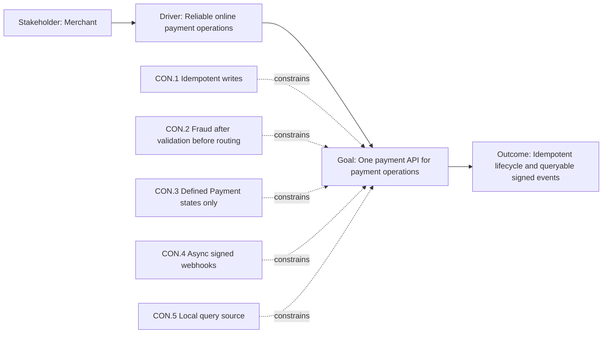

# 01 - Motivation / Strategy

**Title:** Motivation / Strategy - Online Payment Processing Gateway  
**Viewpoint:** ArchiMate Motivation / Strategy  
**Layer(s):** Strategy  
**As-Is | To-Be | Transition:** To-Be  
**Owner:** EA - Team 3  
**RACI:** R EA, A Business Owner, C SA/BA/Sec, I Dev/Test/Ops  
**Version:** v1.0.0  **Date:** 2026-08-21  **Status:** Draft  
**Legend:** influence, association, realization, and constrains are ArchiMate relationships.  
**Scope:** payment authorization, capture, void, refund, lifecycle, queries, and webhooks; excludes card issuing, recurring billing, disputes, 3DS, FX, POS, and KYC/AML.

## Purpose

Merchants need one reliable payment gateway with a gateway-owned lifecycle, idempotent write operations, local queries, and asynchronous signed status notifications.

## ID table

| ID | Element | Type | Statement |
|---|---|---|---|
| MOT.DRV.01 | Reliable online payment operations | Driver | Merchants need predictable payment outcomes. |
| MOT.GOAL.01 | One payment API | Goal | Coordinate all in-scope payment operations. |
| MOT.OUT.01 | Idempotent lifecycle and queryable signed events | Outcome | No duplicate writes; status changes remain observable. |
| STR.CAP.01 | Payment lifecycle management | Capability | Enforce seven Payment states. |
| STR.CAP.02 | Merchant payment notification | Capability | Publish and deliver signed status events asynchronously. |
| MOT.REQ.01 | Gateway-owned state and data | Requirement | Queries do not call external payment systems. |
| MOT.CON.01 | Fraud gate placement | Constraint | Fraud runs after validation and before Acquirer routing. |
