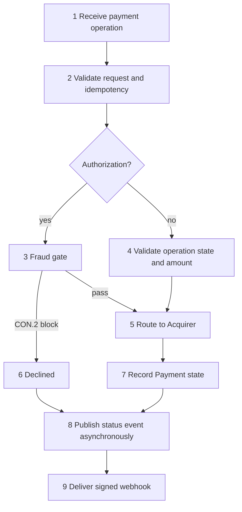

# 02 - Business Process

**Title:** Business Process - Online Payment Processing Gateway  
**Viewpoint:** ArchiMate Business Process  
**Layer(s):** Business  
**As-Is | To-Be | Transition:** To-Be  
**Owner:** BA / PO - Team 3  
**RACI:** R BA/PO, A Business Owner, C EA/SA/Sec/Test, I Dev/Ops  
**Version:** v1.0.0  **Date:** 2026-08-21  **Status:** Draft  
**Legend:** triggering is causal flow; access is read/write of Payment.  
**Scope:** Payment object lifecycle and Merchant-facing operations only.

## Primary process

| Step | Business Role | Business Service | Business Object | Application Component |
|---|---|---|---|---|
| 1 | Merchant | Payment initiation | Payment | Payment API |
| 2 | Merchant | Request validation | Payment | Payment API |
| 3 | Merchant | Fraud gate | Payment | Fraud Engine |
| 4 | Merchant | Lifecycle validation | Payment | Payment Orchestrator |
| 5 | Merchant | Payment routing | Payment | Acquirer Connector |
| 7 | Merchant | Lifecycle recording | Payment | Payment Store |
| 8 | Merchant | Status notification | WebhookEvent | Webhook Event Queue |
| 9 | Merchant | Webhook delivery | WebhookEvent | Webhook Service |

Hard rules: Fraud Engine is authorization-only; invalid transitions reject; Webhook Service is asynchronous and does not block the response; queries use Query Store.
