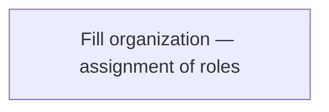

# 03 — Organization / Product

**Pack:** Business (ArchiMate)  
**RACI:** BA/PO **R** (product), EA **C**, Business Owner **A**  
**Handbook:** §3.1  
**Language:** ArchiMate Business — actors, roles, objects, contracts, services. No C4 nesting.  
**Glossary:** [20-appendix.md](20-appendix.md)  
**Names:** [00-index.md](00-index.md)

## Diagram header

```
Title:      ________________________________
Viewpoint:  ArchiMate / C4 / UML ___________
Layer(s):   Strategy / Business / App / Tech
As-Is | To-Be | Transition:  _______________
Owner:      Role ________  Name ____________
Version:    v____  Date ________  Status Draft|Review|Approved
Legend:     relationships listed
Scope:      in-scope systems / out-of-scope
```

## Status

| Field | Value |
| --- | --- |
| Status | Draft / Review / Approved / N/A |
| N/A reason | |
| Owner | |
| Date | |

## Purpose

Actors, roles, business objects, contracts, and the product. Distinguish **product** from **channels / rails / variants** if they are not separate products.

## Organization

| Type | Name | Notes |
| --- | --- | --- |
| Business Actor | | Every C4 Person must appear here |
| Business Actor | | |
| Business Role | | |
| Business Role | | |



## Product

| Item | Name | Notes |
| --- | --- | --- |
| Product | | |
| Variant / rail / channel (if any) | | Not a second product unless stated |
| Contract | | |

## Business objects

Must match Information Structure ([04](04-information-structure.archimate.md)).

| Business Object | Meaning |
| --- | --- |
| | |
| | |

## Business services

| Business Service | Serves | Realized by (application — name identity) |
| --- | --- | --- |
| | | |
| | | |
