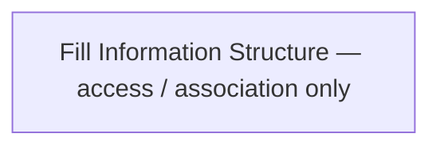

# 04 — Information Structure

**Pack:** Business (ArchiMate conceptual data)  
**RACI:** DA **R**, SA **A**, BA/Sec/Dev/Test **C**  
**Handbook:** §3.1, §4.4  
**Language:** ArchiMate Data Object / Representation. Not UML class internals (that is [10](10-uml-domain-class.md)).  
**Glossary:** [20-appendix.md](20-appendix.md) (SoT)  
**Names:** [00-index.md](00-index.md)

## Diagram header

```
Title:      ________________________________
Viewpoint:  ArchiMate / C4 / UML ___________
Layer(s):   Strategy / Business / App / Tech
As-Is | To-Be | Transition:  _______________
Owner:      Role ________  Name ____________
Version:    v____  Date ________  Status Draft|Review|Approved
Legend:     relationships listed
Scope:      in-scope systems / out-of-scope
```

## Status

| Field | Value |
| --- | --- |
| Status | Draft / Review / Approved / N/A |
| N/A reason | |
| Owner | |
| Date | |

## Purpose

Conceptual data model and aggregates. Name each object's **source of truth**.

## Data objects

| Data Object | Meaning (business) | Representation | Source of truth |
| --- | --- | --- | --- |
| | | | |
| | | | |

## Aggregates (optional)

| Aggregate | Root | Contained / keyed by |
| --- | --- | --- |
| | | |


