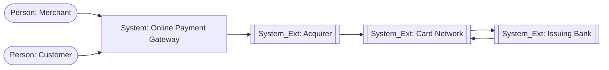

# 05 - C4 Context (L1)

**Title:** C4 Context - Online Payment Gateway  
**Viewpoint:** C4 Context  
**Layer(s):** Application  
**As-Is | To-Be | Transition:** To-Be  
**Owner:** SA - Team 3  
**RACI:** R SA, A Business Owner, C EA/BA/Sec, I Dev/Test/Ops  
**Version:** v1.0.0  **Date:** 2026-08-21  **Status:** Draft  
**Legend:** relationships describe business interactions; no protocol or internal containers appear here.  
**Scope:** Merchant, Customer, Online Payment Gateway, Acquirer, Card Network, Issuing Bank.

No containers, databases, queues, protocols, or component internals are present on this L1 view. Source: [payment-context.puml](views/payment-context.puml).
