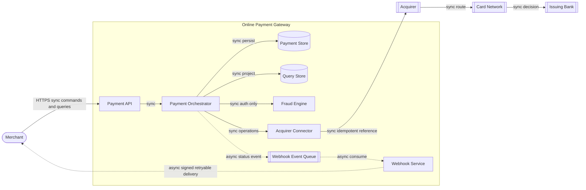

# 06 - C4 Container (L2)

**Title:** C4 Container - Online Payment Gateway  
**Viewpoint:** C4 Container  
**Layer(s):** Application  
**As-Is | To-Be | Transition:** To-Be  
**Owner:** SA - Team 3  
**RACI:** R SA, A SA, C DA/Sec/Dev/Ops, I Owner/BA/Test  
**Version:** v1.0.0  **Date:** 2026-08-21  **Status:** Draft  
**Legend:** solid edges are sync; dashed edges are async; protocol labels are shown only on this C4 view.  
**Scope:** eight internal containers and three named external payment systems.

Fraud Engine is absent from capture, void, and refund paths. Query Store has no external payment dependency. Source: [payment-container.puml](views/payment-container.puml).
