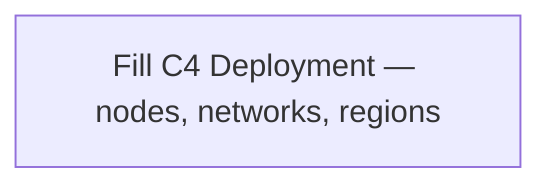

# 07 — C4 Deployment

**Pack:** Solution (C4)  
**RACI:** Ops **R**, SA **A**, Sec/Dev **C**  
**Handbook:** §3.1  
**Language:** C4 Deployment — runtime nodes, networks, regions. Not ArchiMate Technology ([13](13-technology-deployment.archimate.md)).  
**Glossary:** [20-appendix.md](20-appendix.md)  
**Names:** [00-index.md](00-index.md)

## Diagram header

```
Title:      ________________________________
Viewpoint:  ArchiMate / C4 / UML ___________
Layer(s):   Strategy / Business / App / Tech
As-Is | To-Be | Transition:  _______________
Owner:      Role ________  Name ____________
Version:    v____  Date ________  Status Draft|Review|Approved
Legend:     relationships listed
Scope:      in-scope systems / out-of-scope
```

## Status

| Field | Value |
| --- | --- |
| Status | Draft / Review / Approved / N/A |
| N/A reason | Mandatory **if runtime topology changes**; else N/A with sign-off |
| Owner | |
| Date | |

## Purpose

Where containers run: nodes, networks, regions. Kubernetes / cloud are runtime choices — do not invent them as product fact unless this initiative owns that decision (ADR).



| Node / environment | Region | Hosts (C4 containers) | Network / path |
| --- | --- | --- | --- |
| | | | |

| Cluster / account (optional) | Namespace / VPC | Notes |
| --- | --- | --- |
| | | |
