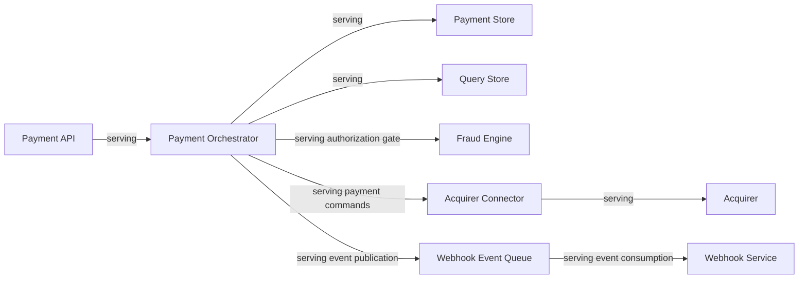

# 08 - Application Cooperation

**Title:** Application Cooperation - Online Payment Gateway  
**Viewpoint:** ArchiMate Application Cooperation  
**Layer(s):** Application  
**As-Is | To-Be | Transition:** To-Be  
**Owner:** SA - Team 3  
**RACI:** R SA, A Business Owner, C EA/DA/Sec/Dev, I BA/Test/Ops  
**Version:** v1.0.0  **Date:** 2026-08-21  **Status:** Draft  
**Legend:** serving relationships only; sync/async protocol labels belong to the C4 view.  
**Scope:** same application component names as C4 L2.

| From | To | ArchiMate relationship | Contract |
|---|---|---|---|
| Payment API | Payment Orchestrator | serving | Payment API command/query contract |
| Payment Orchestrator | Payment Store | serving | Payment lifecycle persistence |
| Payment Orchestrator | Fraud Engine | serving | Authorization fraud decision |
| Payment Orchestrator | Acquirer Connector | serving | Auth/capture/void/refund contract |
| Payment Orchestrator | Webhook Event Queue | serving | Status event contract |
| Webhook Event Queue | Webhook Service | serving | Webhook delivery contract |
