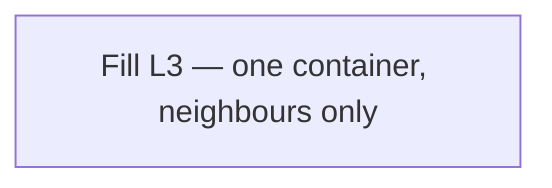

# 09 — C4 Component (L3)

**Pack:** Design (C4 L3)  
**RACI:** Dev **R**, SA **A**, DA/Sec/Test **C**  
**Handbook:** §3.1, §4.9  
**Language:** C4 Component — still C4, not UML. One container only; neighbours, not the whole L2 landscape.  
**Glossary:** [20-appendix.md](20-appendix.md)  
**Names:** [00-index.md](00-index.md)

Copy this file to `09-c4-component-<container>.md`.

## Diagram header

```
Title:      ________________________________
Viewpoint:  ArchiMate / C4 / UML ___________
Layer(s):   Strategy / Business / App / Tech
As-Is | To-Be | Transition:  _______________
Owner:      Role ________  Name ____________
Version:    v____  Date ________  Status Draft|Review|Approved
Legend:     relationships listed
Scope:      in-scope systems / out-of-scope
```

## Status

| Field | Value |
| --- | --- |
| Status | Draft / Review / Approved / N/A |
| N/A reason | |
| Owner | |
| Date | |

## Selected container

| Field | Value |
| --- | --- |
| Container | (rename file) |
| Neighbouring containers | |

Use Mermaid `flowchart` — do **not** use native `C4Component` syntax.


