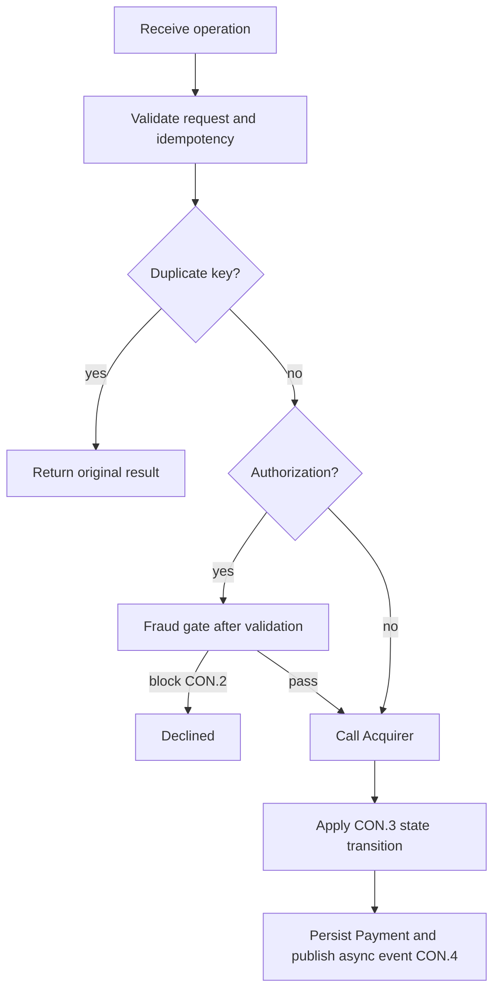
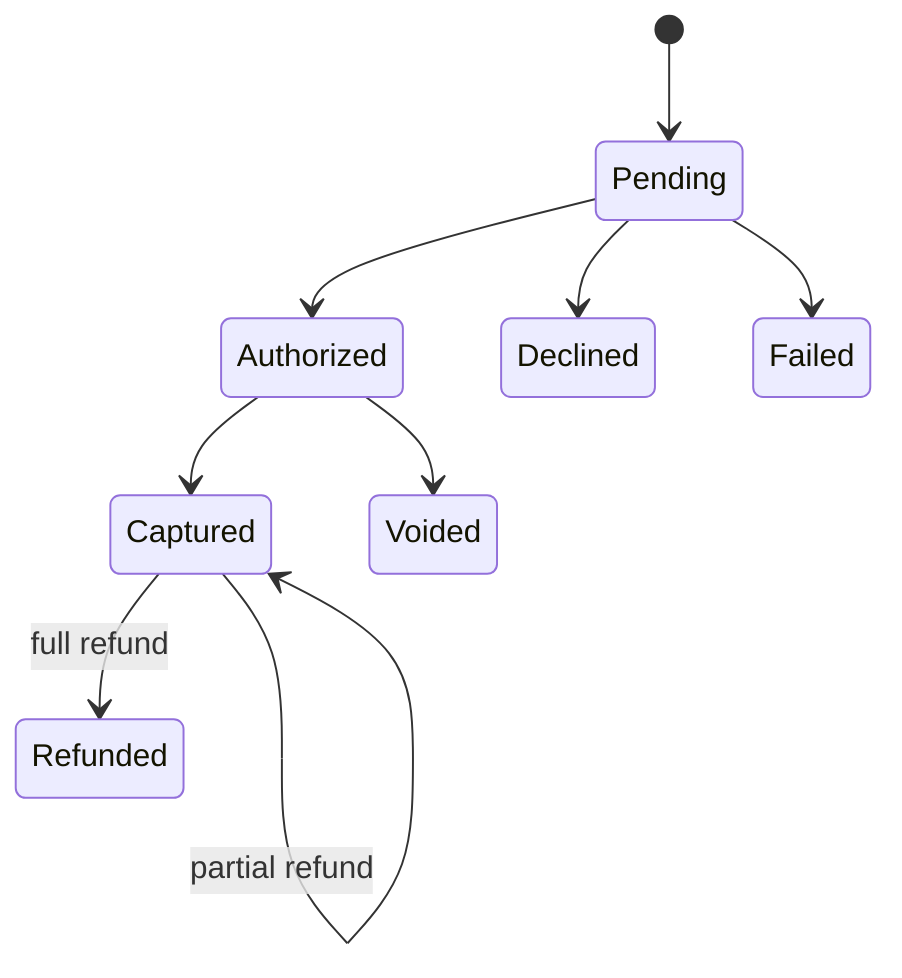

# 12 - UML Activity / State

**Title:** Payment Activity and State  
**Viewpoint:** UML Activity and State  
**Layer(s):** Application / Delivery  
**As-Is | To-Be | Transition:** To-Be  
**Owner:** Test - Team 3  
**RACI:** R Test, A BA, C Dev/SA/Sec, I Owner/Ops  
**Version:** v1.0.0  **Date:** 2026-08-21  **Status:** Draft  
**Legend:** decisions show CON.*; state machine describes one object only; dashed arrows in source views indicate async webhook work.  
**Scope:** Payment workflow and Payment lifecycle.

**Object:** Payment  
**Allowed statuses:** Pending, Authorized, Captured, Voided, Refunded, Declined, Failed  
**Terminal states:** Voided, Refunded, Declined, Failed

Source: [payment-state-activity.puml](views/payment-state-activity.puml). Invalid transitions are explicit API rejects.
