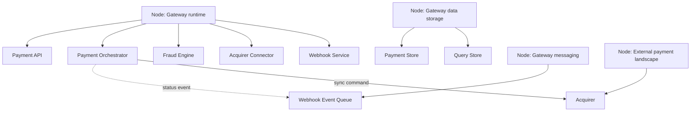

# 13 - Technology (ArchiMate)

**Title:** Technology - Online Payment Gateway  
**Viewpoint:** ArchiMate Technology  
**Layer(s):** Technology  
**As-Is | To-Be | Transition:** To-Be logical deployment  
**Owner:** Ops - Team 3  
**RACI:** R Ops, A SA, C Sec/Dev, I Owner/BA/Test  
**Version:** v1.0.0  **Date:** 2026-08-21  **Status:** Draft  
**Legend:** assignment indicates logical hosting; flow indicates information movement.  
**Scope:** logical runtime locations only; no vendor, pod, cluster, or installation decisions.

Forbidden path: Webhook Event Queue and Webhook Service do not write Payment Store directly.
