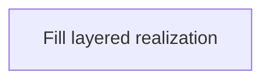

# 14 — Layered realization

**Pack:** Architecture (ArchiMate)  
**RACI:** EA **R**, SA **A**, Ops **C**  
**Handbook:** §3.1, §4.5  
**Language:** ArchiMate — `realization` / `assignment` across layers.  
**Glossary:** [20-appendix.md](20-appendix.md)  
**Names:** [00-index.md](00-index.md)

## Diagram header

```
Title:      ________________________________
Viewpoint:  ArchiMate / C4 / UML ___________
Layer(s):   Strategy / Business / App / Tech
As-Is | To-Be | Transition:  _______________
Owner:      Role ________  Name ____________
Version:    v____  Date ________  Status Draft|Review|Approved
Legend:     relationships listed
Scope:      in-scope systems / out-of-scope
```

## Status

| Field | Value |
| --- | --- |
| Status | Draft / Review / Approved / N/A |
| N/A reason | |
| Owner | |
| Date | |

## Purpose

Cross-layer alignment: Business Service → Application Service → Application Component → Node.

**Nesting thread (this initiative):** Capability → System (C4 L1) → Container (C4 L2) → Component (C4 L3) → behaviour (UML).


