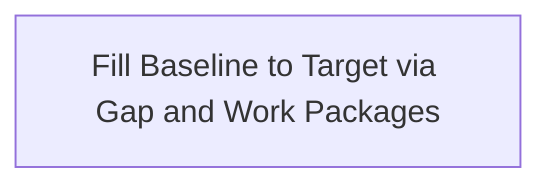

# 16 — Migration / Plateau

**Pack:** Implementation  
**RACI:** EA **R**, Business Owner **A**, SA/BA/Sec/Ops **C**  
**Handbook:** §3.1, §4.6  
**Language:** ArchiMate Implementation & Migration — Plateau, Gap, Work Package.  
**Glossary:** [20-appendix.md](20-appendix.md)

## Diagram header

```
Title:      ________________________________
Viewpoint:  ArchiMate / C4 / UML ___________
Layer(s):   Strategy / Business / App / Tech
As-Is | To-Be | Transition:  _______________
Owner:      Role ________  Name ____________
Version:    v____  Date ________  Status Draft|Review|Approved
Legend:     relationships listed
Scope:      in-scope systems / out-of-scope
```

## Status

| Field | Value |
| --- | --- |
| Status | Draft / Review / Approved / N/A |
| N/A reason | If replacing as-is |
| Owner | |
| Date | |

## Purpose

Transition architectures: Plateau 0 → 1 → N.



| Gap | Meaning |
| --- | --- |
| | |
| | |
